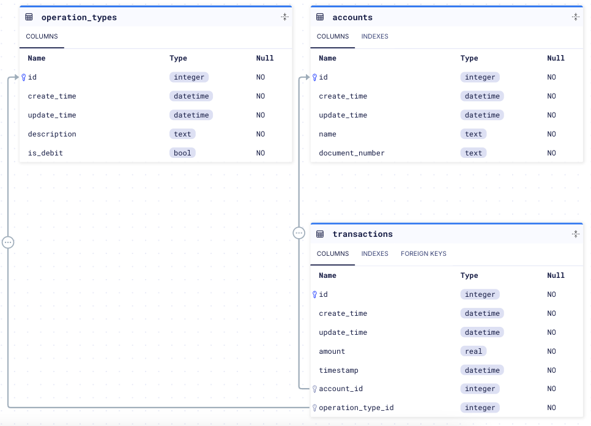

# Transactor Server

This server exposes 3 APIs -

1. POST [/api/v1/accounts](/api/v1/accounts) to create a new account
2. GET [/api/v1/accounts/:id](/api/v1/accounts/:id) to get a created account
3. POST [/api/v1/transactions](/api/v1/transactions) to create a new transaction record

## Tech Stack -

- Server is written in **Go**!
- Postgres for DB
- [entgo](https://entgo.io/) as an ORM
- [Fiber](https://gofiber.io/) for routing
- [swago](https://github.com/swaggo/swag) to auto generate Swagger docs
- zap as logging framework
- Signoz for metrics, traces & logging with correlation
- For versioned migrations we use https://atlasgo.io/
- https://github.com/go-ozzo/ozzo-validation for validations

## Features -

- The app is dockerized and the image is pushed to ghcr!
- There are unit tests which are also run in docker build pipeline!!!
- All http requests are traced, metered and logged via opentelemetry!
- Additionally the Business Logic Service (more on this below) also log custom metrics
- A swagger doc is present at `/swagger`
- Healthcheck on up status of container
- A Basic API Key based authenticated is added to the APIs
- All APIs have basic set of validatiors
- A GitHub action tests and builds the docker image on repo push

## Philosophy & Structure -

The App is basically designed like rings of onion. i.e. the app is layered.
API -> Service -> DAO -> DB

Here Service & DAO are also interfaces allowing for easy unit tests and replacability.

For example currently the DAO is integrating Postgres directly, we can easily create a new implementation to change the database. Or even wrap the existing DAO with a caching layer!

There are 2 main set of API Service present -

1. Account
   NOTE: The Account service to demonstrate the extensibility of the architecure is wrapped in "tracedService" layer which injects traces & logs to the existing service implementation. Additionally it also wrapped in a "meteredService" which registers metrics for the service.
2. Transaction

Both also have unit tests for API, Service & DAO

The error structure is centralised with this schema -

```json
{
  "namespace": "db",
  "code": "not_found",
  "msg": "ent: account not found"
}
```

All the APIs also have basic set of validators that make sense and incase of validation errors the response tells what those errors are -

```json
{
  "namespace": "validation",
  "code": "validation_failed",
  "errors": {
    "name": "the length must be between 8 and 100"
  }
}
```

The database schema can be found here https://gh.atlasgo.cloud/explore/03c72b8c
This was generated with atlas cli!



## How to run?

### Without logs, metrics & traces

Simply run `make up traced=false`

The server starts with an API Key "strongapikey".
After that the swagger docs can be accessed at [http://localhost:8080/swagger](http://localhost:8080/swagger)

NOTE: Click "Authorize" in Swagger UI!

### With logs, metrics & traces

If you want to view logs, metrics & traces we first need to also setup Signoz https://signoz.io/

To do this run this `make signoz-setup`. NOTE: this will take a few minutes to setup.

After thats done go to http://localhost:3301 and login with email - `admin@admin.com` & password - `12345678`

Now to run the app with logs, metrics & traces enabled `make up`

The server starts with an API Key "strongapikey".
After that the swagger docs can be accessed at [http://localhost:8080/swagger](http://localhost:8080/swagger)

NOTE: Click "Authorize" in Swagger UI!

The Metrics can be viewed here - http://localhost:3301/services/transactor-server?relativeTime=15m

Traces here - http://localhost:3301/traces-explore

Logs here - http://localhost:3301/logs/logs-explorer

## Seed Data -

There is a K6 based seed script provided which calls the create account api 100 times and for each account it creates 5 transaction using the API.

To run it simply execute `make seed`. This will run the k6 seed script in a docker container. NOTE: make sure the server is running first.

## Cleanup -

To cleanup simply run - `make down`. This will tear down all the resources (stop and delete containers if they were created).
